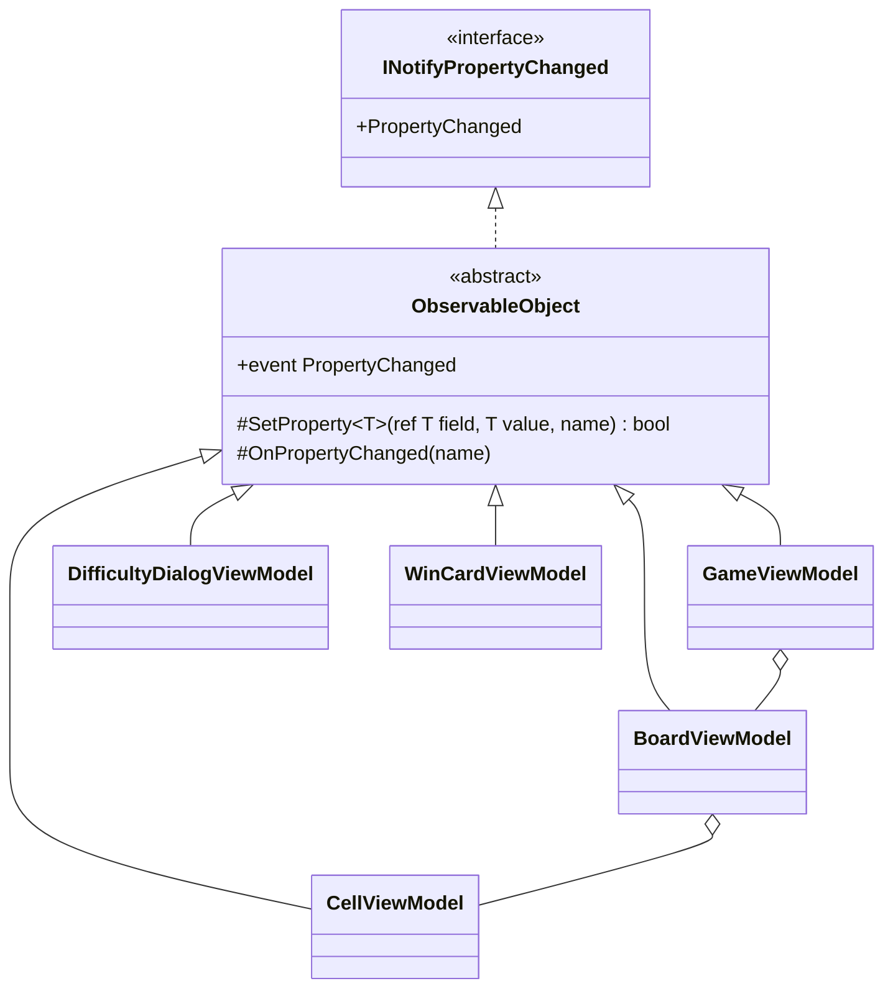

# 課題 T2: ビューモデルの変化の通知の設計

## 0. What(何を作り、何を作らないか)

- **作る**: 5 つのビューモデルが `INotifyPropertyChanged` を同じ一つの書き方で満たすための、最小の共通部品と、それを使った各ビューモデルの書き方の決まり。
- **作らない**: コマンド(`ICommand`)の共通部品、依存するプロパティを自動で通知する仕組み(属性や依存表)、UI スレッドへの自動の切り替え、一括の通知、`INotifyPropertyChanging`、検証(`INotifyDataErrorInfo`)。どれも課題の要求(プロパティの変化を View に知らせる)の外にあり、今の 5 つのビューモデルに必要だという根拠がない(5 章)。

### 置いた仮定

1. ビューモデルの状態は、すべて UI スレッドで変わる。経過時間は Avalonia の `DispatcherTimer`(UI スレッドで動く)で進める。別のスレッドから変える場面が出たら、その場面で `Dispatcher.UIThread.Post` に包む(共通部品では扱わない)。
2. マスの状態はゲームのルールの側(例: `CellState` という列挙)から与えられる。ビューモデルはそれを受け取って表示に写すだけである。
3. 盤面のマスの並びは、1 回のゲームの間は増えも減りもしない。難易度が変わると、並び全体が作り直される。
4. プロジェクトは `Nullable` が有効で、C# の最新の言語機能(`field` キーワードを含む)を使える。ただし、書き方をそろえるため、`field` キーワードは使わず、明示的なフィールドで書く(3 章の理由の 5)。

## 1. 型の構成



| 型 | ひとことで言うと | 公開する範囲 |
|---|---|---|
| `ObservableObject`(abstract) | プロパティの変化を `INotifyPropertyChanged` の契約どおりに知らせるもの | `PropertyChanged` イベント(public)、`SetProperty`・`OnPropertyChanged`(protected) |
| 5 つのビューモデル(すべて `sealed`) | 各画面・各部品の状態を View に見せるもの | 読み取り用のプロパティ(setter は private)と、状態を変える操作のメソッド |

継承は 1 段だけとし、`ObservableObject` には通知以外の仕事を置かない。`virtual` のメンバーも置かない(上書きする利用者がいない)。

### 各ビューモデルでの書き方の決まり

1. **値を持つプロパティ**は、private のフィールドと `SetProperty` で書く。プロパティ名は `[CallerMemberName]` で渡し、文字列を書かない。
2. **setter は private** にし、状態は意図を表すメソッド(`Update`、`Tick` など)で変える。View から書き換えられるのは、ダイアログの入力欄のように双方向の結び付けが要るプロパティだけにする。
3. **他のプロパティから計算するプロパティ**は、フィールドを持たない getter で書き、元のプロパティの `SetProperty` が `true` を返したときに `OnPropertyChanged(nameof(計算するプロパティ))` を呼ぶ。通知の抜けは、元のプロパティのすぐ下を読めば確かめられる。
4. **子のビューモデル**(盤面の中のマス、ゲームの中の盤面)は、それぞれが自分のプロパティの変化を自分で知らせる。親は子のプロパティの変化を代わりに通知しない。
5. **マスの並び**は `IReadOnlyList<CellViewModel>` で見せる。1 回のゲームの中では並びは変わらないので `ObservableCollection` は使わない。難易度が変わったら並びごと作り直し、`Cells` プロパティの変化として `SetProperty` で知らせる(仮定 3)。

## 2. コード

### 共通部品

```csharp
using System.Collections.Generic;
using System.ComponentModel;
using System.Runtime.CompilerServices;

namespace Shos.Minesweeper.Desktop.ViewModels;

/// <summary>プロパティの変化を INotifyPropertyChanged の契約どおりに View に知らせる。</summary>
public abstract class ObservableObject : INotifyPropertyChanged
{
    public event PropertyChangedEventHandler? PropertyChanged;

    /// <summary>値が変わったときだけ代入して通知する。変わったかどうかを返す。</summary>
    protected bool SetProperty<T>(ref T field, T value, [CallerMemberName] string propertyName = "")
    {
        if (EqualityComparer<T>.Default.Equals(field, value))
            return false;

        field = value;
        OnPropertyChanged(propertyName);
        return true;
    }

    protected void OnPropertyChanged([CallerMemberName] string propertyName = "")
        => PropertyChanged?.Invoke(this, new PropertyChangedEventArgs(propertyName));
}
```

### ビューモデルの例: `CellViewModel`(状態と、それから計算する読み上げの名前)

```csharp
namespace Shos.Minesweeper.Desktop.ViewModels;

/// <summary>盤面の 1 マスの状態を View に見せる。</summary>
public sealed class CellViewModel(int row, int column) : ObservableObject
{
    CellState state = CellState.Unopened;

    public int Row { get; } = row;
    public int Column { get; } = column;

    public CellState State
    {
        get => state;
        private set
        {
            if (SetProperty(ref state, value))
                OnPropertyChanged(nameof(AccessibleName)); // AccessibleName は State から計算するため
        }
    }

    /// <summary>スクリーンリーダーが読み上げる名前。</summary>
    public string AccessibleName => CellNames.Of(State, Row, Column);

    /// <summary>ゲームの状態が変わった後に、盤面の側から呼ばれる。</summary>
    public void Update(CellState newState) => State = newState;
}
```

(`CellNames.Of` は、読み上げの名前を作る共有の部品を仮定したもの。)

### 通知を確かめるテスト(xUnit)

```csharp
public class CellViewModelTests
{
    [Fact]
    public void UpdatingStateNotifiesStateAndAccessibleName()
    {
        var cell = new CellViewModel(0, 0);
        var changed = new List<string?>();
        cell.PropertyChanged += (_, e) => changed.Add(e.PropertyName);

        cell.Update(CellState.Flagged);

        Assert.Equal([nameof(CellViewModel.State), nameof(CellViewModel.AccessibleName)], changed);
    }

    [Fact]
    public void UpdatingToTheSameStateNotifiesNothing()
    {
        var cell = new CellViewModel(0, 0);
        var changed = new List<string?>();
        cell.PropertyChanged += (_, e) => changed.Add(e.PropertyName);

        cell.Update(CellState.Unopened);

        Assert.Empty(changed);
    }
}
```

Avalonia を起動せずに、イベントを購読するだけで通知の有無と順序を確かめられる。

## 3. Why(そう決めた理由)

1. **Once And Only Once**: 「値が変わったときだけ代入して、名前を付けて通知する」という意図は、5 つのビューモデルのすべてのプロパティで同じである。各ビューモデルに書けば、同じ意図が 5 か所に重複し、どれか 1 つだけ等値の判定が抜ける、といった食い違いが起こりうる。1 か所に置けば、通知の決まりを変えるときの修正先が 1 つになる(ひとつの変更 → ひとつの修正)。
2. **継承を選んだ理由(合成と比べて)**: スキルは「共通処理の再利用だけが目的の継承は合成に変える」と定めている。ここで継承を使うのは、次の 2 点による。
   - `ObservableObject` は `INotifyPropertyChanged` という契約を実装する型で、5 つのビューモデルは「View が変化を購読できるもの」の一種(is-a)として、その契約をそのまま守る。基底に置くのは契約を満たす仕組みだけで、画面やゲームの責務は一切置かないので、責務が基底と派生に分散しない。
   - C# では、イベントを起こせるのはそれを宣言した型だけである(判断ルール 11: 言語の違い)。合成にすると、5 つのビューモデルのそれぞれに `event` の宣言と、補助のクラスへ転送する `SetProperty` を書くことになり、1 の重複が形を変えて残る。
   - 壊れやすい基底クラスの心配は小さい。基底は 2 つのメソッドだけで、`virtual` を持たず、継承は 1 段である。
3. **読解コストを下げる抽象である(判断ルール 2)**: `SetProperty` は、プロパティごとの 5〜6 行の定型(比較・代入・通知)を 1 行にし、プロパティの本体に「何を通知するか」だけが残るようにする。一方、依存するプロパティを自動で通知する仕組みは、読む対象(属性、依存の表、その解釈)を増やすので入れない。5 つのビューモデルでは、依存するプロパティは数えるほどで、元のプロパティのすぐ下に 1 行書けば足りる。
4. **`SetProperty` が `bool` を返す理由**: 依存するプロパティの通知(決まり 3)や、値が変わったときだけの後続の処理を、呼び出し側が変化の有無で書き分けられるようにするため。変わらない値で通知しないことは、無駄な再描画を避けるだけでなく、「通知が来た = 変わった」という View 側の前提を守る。
5. **明示的なフィールドで書く理由**: `field` キーワードを使えばフィールドの宣言を省けるが、ビューモデルによって書き方が混ざると、通知の抜けを読んで確かめにくくなる(第六箇条: ルールの統一)。どの書き方でもよいが、5 つで 1 つにそろえることを優先した。
6. **名前**: `ObservableObject` は提供するサービス(変化を観察できる)を表す名前である。`ViewModelBase` は「基底である」という実装の事情を名前に入れ、何をするかを表さないので採らない。なお、CommunityToolkit.Mvvm にも同名の型があるが、ここでは使わないと決めているので衝突しない。同名で読み手が同じ使い方(`SetProperty`、`OnPropertyChanged`)を期待できることは、むしろ読みやすさの利点になる。
7. **Testable**: 通知は `PropertyChanged` を購読するだけで確かめられる(2 章のテスト)。ビューモデルの判断を Avalonia を起動せずに xUnit で確かめられる。

### 捨てた案

| 案 | 捨てた理由 |
|---|---|
| 各ビューモデルが `INotifyPropertyChanged` を直接実装し、private の `SetProperty` をそれぞれに持つ | 同じ意図が 5 か所に重複する(Once And Only Once に反する)。基底クラスを避ける利点(各クラスの全体像が 1 ファイルで分かる)は、基底が 2 メソッドだけなので小さい |
| 合成(通知の補助のクラスを各ビューモデルが持つ) | C# ではイベントを宣言した型しか起こせないので、`event` の宣言と転送が 5 か所に残る(理由 2) |
| 依存するプロパティを属性などで宣言し、自動で通知する | 読む対象を増やすだけの抽象で、今の規模では手で 1 行書く方が読みやすい(YAGNI 違反) |
| 通知の名前を文字列で書く | 名前の変更で黙って壊れる。`[CallerMemberName]` と `nameof` なら、コンパイラーが確かめる |

## 4. 作らなかったもの(引き算)

- `ICommand` の共通部品: 課題の範囲(変化の通知)の外。要るならボタンの操作を設計するときに別に決める。
- UI スレッドへの自動の切り替え: 仮定 1 のとおり、変化はすべて UI スレッドで起きる。起こってもいない別スレッドからの変更に備えない。
- 一括の通知(全プロパティの変化を 1 回で知らせる): 使う場面が今はない。
- `OnPropertyChanged` を `virtual` にすること、`INotifyPropertyChanging`、`INotifyDataErrorInfo`: 使う利用者がいない。カスタムの難易度の入力の検証が要るときは、そのときに `DifficultyDialogViewModel` の設計として決める。

## 5. 検証結果

- 設計の相談なので、ビルドとテストは実行していない。2 章のコードとテストは、この設計の形を示すためのもので、コンパイルは確かめていない(`CellState`、`CellNames` は仮定した型)。

## 6. ユーザーの判断が要る点

- 基底クラス(継承)を使うこと。スキルの「再利用のための継承は合成に変える」に対して、理由 2 の根拠で例外とした。基底クラスを避ける方針であれば、各ビューモデルに直接実装する案(重複を受け入れる)になる。
- 型の名前 `ObservableObject`。CommunityToolkit.Mvvm と同名であることを避けたければ、`NotifyingObject` などに変える。
- `field` キーワードを使わず、明示的なフィールドにそろえること(理由 5)。
