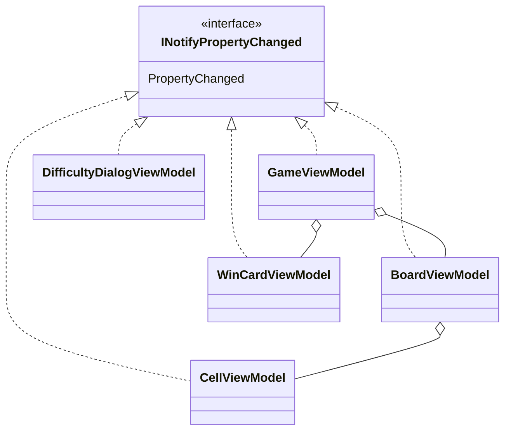

# T2 ビューモデルの変化の通知の設計

## 作業の分類と読んだもの

設計の相談（判断を伴う作業）として扱った。SKILL.md の表に従い、「必ず読む」の object-design.md を読んだ。基底クラスを新しく作るかどうかが論点なので、「必要なら読む」の simplicity.md も読んだ。

## What（決めたこと）

**共通の基底クラスは作らない。5 つのビューモデルは、それぞれ `INotifyPropertyChanged` を直接実装し、同じ 3 つの決まりで書く。**

1. イベントは各クラスで宣言する: `public event PropertyChangedEventHandler? PropertyChanged;`
2. 通知を出すのは、各クラスの private メソッド `OnPropertyChanged([CallerMemberName] string propertyName = "")` の 1 か所だけにする（1 行の式形式）。
3. 値を持つプロパティは、C# 14 の `field` キーワードを使って書く。値が同じなら何もしない（`if (field == value) return;`）。値が変わったら、自分の名前を通知する（引数を省いて `CallerMemberName` に任せる）。そのプロパティから計算されるプロパティ（読み取り専用）も、同じセッターの中で `nameof(...)` で通知する。プロパティ名を文字列リテラルで書くことはしない。

### 型の構成



- どのクラスも `sealed` にする。継承の階層はない。
- 足す型はない（基底クラスも、補助の静的クラスも、ジェネリックの `SetProperty<T>` も作らない）。
- 集約の関係（Game が Board と WinCard を持ち、Board が Cell を持つ）は、通知の書き方とは関係がない。仮定として図に入れた。子のビューモデルは自分の変化を自分で通知する。親は子の通知を中継しない（View が子に直接バインドする）。

### 例: `CellViewModel`（プロパティ 2 つ）

```csharp
using System.ComponentModel;
using System.Runtime.CompilerServices;

public sealed class CellViewModel : INotifyPropertyChanged
{
    public event PropertyChangedEventHandler? PropertyChanged;

    public CellState State
    {
        get;
        set
        {
            if (field == value) return;
            field = value;
            OnPropertyChanged();
            OnPropertyChanged(nameof(IsOpened));
        }
    }

    public bool IsOpened => State == CellState.Opened;

    void OnPropertyChanged([CallerMemberName] string propertyName = "")
        => PropertyChanged?.Invoke(this, new PropertyChangedEventArgs(propertyName));
}
```

- `State` は値を持つプロパティで、`IsOpened` は `State` から計算するプロパティである。`IsOpened` は自分で値を持たないので、変化の通知は、元になる `State` のセッターが出す。
- 変化の通知を確かめるテスト（xUnit）の形は次のとおりである。Avalonia を起動せずに書ける。

```csharp
[Fact]
public void ChangingStateNotifiesStateAndIsOpened()
{
    var cell = new CellViewModel();
    var names = new List<string?>();
    cell.PropertyChanged += (_, e) => names.Add(e.PropertyName);

    cell.State = CellState.Opened;

    Assert.Equal([nameof(CellViewModel.State), nameof(CellViewModel.IsOpened)], names);
}

[Fact]
public void SettingTheSameStateDoesNotNotify()
{
    var cell = new CellViewModel { State = CellState.Opened };
    var notified = false;
    cell.PropertyChanged += (_, _) => notified = true;

    cell.State = CellState.Opened;

    Assert.False(notified);
}
```

## Why（そう決めた理由）

1. **基底クラスを作る理由が「共通の処理を使い回す」ことだけだから。** よくある形は `ViewModelBase`（`SetProperty<T>` と `OnPropertyChanged` を持つ抽象クラス）である。しかし、Avalonia のバインディングは `INotifyPropertyChanged` という契約だけを見る。`ViewModelBase` として 5 つを入れ替えて使う利用者（多態）はどこにもいない。スキルの判断ルール 9（継承 vs 合成）は「共通処理の再利用だけが目的の継承はしない」と定めていて、`ViewModelBase` はちょうどこの例に当たる。基底クラスを作らなければ、どのビューモデルも、自分のファイルを読むだけで全体が分かる（object-design.md の「再利用のための継承は合成に変える」の確かめ方）。
2. **合成に変えるほどの共通の処理もないから。** 継承の代わりに補助のオブジェクト（通知を任せる部品）を持たせる形も考えた。しかし、イベントはクラス自身が宣言しなければならない。だから、補助のオブジェクトを使っても、イベントの add/remove を転送する行か、デリゲートを受け取る引数（4〜5 個）が増えるだけである。各クラスに残る共通の部分は、イベントの宣言と `OnPropertyChanged` の 2 行だけである。この 2 行は、言語が定める `INotifyPropertyChanged` の実装の定型であり、`IDisposable` を実装するときと同じ種類のものである。部品に分けると、読む対象が増えるわりに、読む手間は減らない（判断ルール 2 の「読む対象を増やすだけの抽象」に当たる）。
3. **ジェネリックの `SetProperty<T>(ref T field, T value, ...)` も要らないから。** .NET 10 の C# 14 では `field` キーワードを使える。バッキング フィールドを宣言しないで、セッターに「同じなら戻る → 代入 → 通知」の 3 行を書ける。そのため、`SetProperty<T>` を作っても、1 行が短くなるだけである。一方、セッターのその場で、値が変わったときに何を通知するか（計算されるプロパティ、状態を変えるコマンドなど）が読める利点がある。比べる方法は `==` を使う。このマインスイーパーで値を持つプロパティは、列挙型・`bool`・`int`・`string`・`TimeSpan` になりそうで、どれも `==` で正しく比べられる（仮定。下の「作らなかったもの」を参照）。
4. **Once And Only Once は、「通知を出す場所」を各クラスの 1 か所に絞って守っている。** 5 つのクラスに同じ 2 行が並ぶが、これらは「同じ意図を 1 か所に集めるべき重複」ではない。重複を消すと Once And Only Once にかなうが、それには基底クラス（上の 1）が要る（判断ルール 6 の「同じ意図か」の判定）。集めるべきなのは、次の「見直す条件」に書いた変更が実際に来たときである。
5. **テストしやすいから。** 通知は `PropertyChanged` を購読すれば観察できる。ビューモデルは Avalonia の型に依存しないので、Avalonia を起動せずに xUnit で確かめられる。
6. **名前を間違えないようにするため。** 自分の名前は `CallerMemberName` に、ほかのプロパティの名前は `nameof` に任せ、文字列リテラルを書かない。こうすれば、名前を変えたときに通知だけが古い名前のまま残ることがない。

### 捨てた案とのトレードオフ

| 案 | 利点 | 捨てた理由 |
|---|---|---|
| 抽象クラス `ViewModelBase` と `SetProperty<T>` | 各クラスの 2 行が消える。よく知られた形 | 使い回すためだけの継承になる（判断ルール 9）。読む人が基底クラスを見に行く必要がある |
| 通知を任せる部品を合成する | 継承を避けられる | イベントの転送のコードが増え、2 行の定型より長くなる |
| 静的な補助のメソッド `Notify.Set(ref field, value, handler, sender, name)` | 継承も合成もしない | 引数が 5 つになり（目安の 3 を超える）、呼び出しのほうが読みにくい |
| MVVM の支援ライブラリ | ソース ジェネレーターで書く量が減る | 使わないと決まっている（課題の前提） |

## 作らなかったもの・置いた仮定

- **UI スレッドへの切り替え（Dispatcher）は入れていない。** 経過時間の更新は Avalonia の `DispatcherTimer` で行い、すべての変化は UI スレッドで起きると仮定した。ほかのスレッドから変化が来ることになったら、その仕組みが要る。
- **複数の変化をまとめて通知したり、通知を遅らせたりする仕組みは作っていない。** 新しいゲームを始めて盤面を作り直すときは、`BoardViewModel` が新しい `CellViewModel` の集まりを作って、それを持つプロパティの変化を 1 回通知すればよい、と仮定した。
- **`PropertyChangedEventArgs` をキャッシュしていない。** 通知のたびに作られるが、計測していない最適化はしない（判断ルール 5）。
- **`EqualityComparer<T>.Default` で比べていない。** 値を持つプロパティは `==` が正しく値を比べる型だけだと仮定した。参照型のコレクションや、`==` を定義していない構造体をプロパティにするときは、そのセッターだけで比べ方を考える。
- **`CellState` の中身、`State` のセッターを誰が呼ぶか（例の `public set`）は仮定である。** 実際の設計では、盤面のモデルから状態を写すメソッドを通してだけ変える形（セッターを `private` にする）でもよい。どちらにしても、通知の書き方は変わらない。
- **親が子の通知を中継する仕組み（`GameViewModel` が `BoardViewModel` の変化を再び通知するなど）は作っていない。**

## 見直す条件（基底クラスや部品を入れてよいとき）

次のどれかが実際に起きたら、`OnPropertyChanged` を 1 か所に集める（その時点で、基底クラスにするか、部品を合成するかを選ぶ）。

- 5 つの通知の出し方を、まとめて変える必要ができた（別のスレッドから UI スレッドへの切り替え、通知をまとめる、ログを取るなど）。そうなると、2 行の定型ではなく、同じ意図の重複になる。
- ビューモデルが増えて、定型を書き写すときの間違い（イベントの宣言のし忘れなど）が実際に起きた。

## 検証結果

- `CellViewModel` の例を、.NET SDK 10.0.112 の `net10.0` のコンソール プロジェクトでビルドして動かした。`State` を `Opened` に 2 回設定したときに、通知されたのは `State,IsOpened` の 1 回だけだった（2 回目の設定では、値が同じなので通知されなかった）。
- 上の xUnit のテストの形は、実行していない（パッケージを取るネットワークが使えないため）。
- 確かめた際の一時的なプロジェクトが、作業フォルダーの `check/` に残っている（消す権限がなかった）。

## ユーザーの判断が要る点

- 基底クラスを作らないことにしたので、5 つのクラスに同じ 2 行が並ぶ。チームの慣れから `ViewModelBase` を好む場合は、判断ルール 9 との食い違いを承知したうえで決めてほしい。
- 値を持つプロパティのセッターを公開するか、モデルから写すメソッドを通してだけ変えるか（例では公開にした）。
