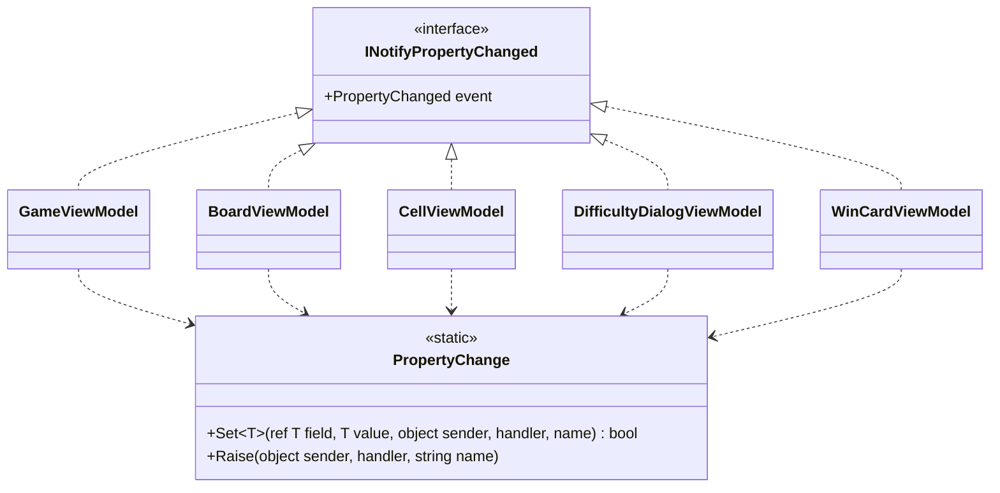

# T2: ビューモデルの変化の通知の設計

## 1. 何を決めるか（What）

5 つのビューモデル（`GameViewModel`、`BoardViewModel`、`CellViewModel`、`DifficultyDialogViewModel`、`WinCardViewModel`）が、`INotifyPropertyChanged` をどう実装するかを決める。どれでも同じになるのは次の二つの手順である。

1. 新しい値が今の値と同じなら何もしない。違えば、フィールドを書き換えて通知する
2. 他のプロパティから計算されるプロパティ（派生プロパティ）について、元の値が変わったときに通知する

作らないもの: MVVM の支援ライブラリの代わりになる枠組み（コマンドの基盤、メッセンジャー、検証の仕組みなど）。この課題は変化の通知だけである。

## 2. 型の構成



- 5 つのビューモデルは、それぞれが `INotifyPropertyChanged` を直接実装し、`PropertyChanged` イベントを自分で宣言する。**共通の基底クラス（`ViewModelBase` など）は作らない。**
- 「同じ値なら通知しない」と「イベントを起こす」の手順は、静的クラス `PropertyChange` の 2 つのメソッドに 1 か所だけ置き、各ビューモデルがそれを呼ぶ（合成）。
- イベントはそれを宣言したクラスの外からは起こせないので、`PropertyChange` には、ビューモデルが自分のイベントのデリゲート（`PropertyChanged`）と自分自身（`this`）を渡す。

### 共通の部品

```csharp
using System.Collections.Generic;
using System.ComponentModel;
using System.Runtime.CompilerServices;

namespace Shos.Minesweeper.Desktop.ViewModels;

/// ビューモデルのプロパティの変化を View に知らせる手順。
static class PropertyChange
{
    /// 値が変わったときだけ、フィールドを書き換えて通知する。変わったら true を返す。
    public static bool Set<T>(ref T field, T value, object sender, PropertyChangedEventHandler? handler,
                              [CallerMemberName] string propertyName = "")
    {
        if (EqualityComparer<T>.Default.Equals(field, value))
            return false;
        field = value;
        Raise(sender, handler, propertyName);
        return true;
    }

    /// 派生プロパティのように、フィールドを持たないプロパティの変化を知らせる。
    public static void Raise(object sender, PropertyChangedEventHandler? handler, string propertyName)
        => handler?.Invoke(sender, new PropertyChangedEventArgs(propertyName));
}
```

## 3. 例: `CellViewModel`

マス 1 つの見た目（未開放・旗・開放済みの数字など）と、それから計算される読み上げの名前の 2 つのプロパティを持つ例である。マスの状態はゲームの進行の側が決めるので、View から書き換えられないように、setter は private にして、`Update` から変える。

```csharp
using System.ComponentModel;

namespace Shos.Minesweeper.Desktop.ViewModels;

/// 盤面の 1 マスを、View に表示できる形で表す。
sealed class CellViewModel : INotifyPropertyChanged
{
    CellAppearance appearance = CellAppearance.Unopened;

    public event PropertyChangedEventHandler? PropertyChanged;

    public CellViewModel(int column, int row) => (Column, Row) = (column, row);

    public int Column { get; }
    public int Row    { get; }

    public CellAppearance Appearance {
        get => appearance;
        private set {
            if (PropertyChange.Set(ref appearance, value, this, PropertyChanged))
                // AccessibleName は Appearance から計算されるので、一緒に知らせる
                PropertyChange.Raise(this, PropertyChanged, nameof(AccessibleName));
        }
    }

    /// スクリーン リーダーが読み上げる名前（例: 「3 行 5 列、旗」）
    public string AccessibleName => CellNames.Of(Row, Column, Appearance);

    /// ゲームの状態が変わったときに、そのマスの見た目を反映する。
    public void Update(CellAppearance newAppearance) => Appearance = newAppearance;
}
```

（`CellAppearance` はマスの見た目の列挙型、`CellNames.Of` は読み上げの名前を作る関数で、どちらもこの課題の外にある仮定の型である。）

他の 4 つのビューモデルも同じ形で書く。

- 値を持つプロパティ: `set => PropertyChange.Set(ref field, value, this, PropertyChanged);`
- 派生プロパティ: 元のプロパティの setter で、`Set` が true を返したときに `PropertyChange.Raise(..., nameof(派生プロパティ))` を呼ぶ
- 名前は `[CallerMemberName]` と `nameof` だけで渡し、文字列のリテラルでは書かない

## 4. そう決めた理由（Why）

### 4.1 基底クラスを作らない

よくある形は `ViewModelBase : INotifyPropertyChanged` に `SetProperty` を置き、5 つが継承するものである。これを採らない。

- この基底クラスの動機は「通知の数行の定型を共有したい」だけで、5 つのビューモデルは互いに「〜の一種」として差し替えて使われるわけではない（`BoardViewModel` の代わりに `WinCardViewModel` を渡す場面はない）。再利用のためだけの継承であり、多態のための継承ではない。
- 継承にすると、各ビューモデルの全体像（どのイベントを持ち、どう起こすか）が基底クラスを見ないと分からなくなる。また、基底クラスは「どのビューモデルにも要りそうなもの」（一括の通知、検証、Dispose など）を足していく置き場になりやすく、変えると 5 つすべてに波及する（壊れやすい基底クラス）。
- C# の単一継承の枠を、通知という小さな関心事のために使ってしまう。

その代わりに、共有したい手順を静的なメソッドにした（合成）。各ビューモデルに残る重複は、イベントの宣言 1 行と、`PropertyChange.Set(...)` の呼び出しだけである。この数行の重複は、継承を避ける代価として受け入れる。

### 4.2 手順は 1 か所に置く（Once And Only Once）

「同じ値なら通知しない」の比較（`EqualityComparer<T>.Default`）と、イベントを起こす手順は、各ビューモデルに private メソッドとして 5 回書くこともできる。しかし、これは同じ意図の手順であり、比較の仕方を変えるとき（例: 浮動小数点の比較）に 5 か所を直すことになる。静的なメソッドにすれば、継承なしで 1 か所にまとめられる。

### 4.3 名前の書き間違いを型で防ぐ

プロパティ名を文字列で書くと、名前を変えたときに通知だけが黙って壊れる。setter では `[CallerMemberName]` を、派生プロパティでは `nameof` を使い、名前の変更をコンパイラーが追えるようにした。

### 4.4 Testable

- `PropertyChange` は、ハンドラーを渡すだけで単体テストできる（同じ値では呼ばれない、違う値では 1 回呼ばれて名前が正しい、ハンドラーが null でも例外にならない）。
- 各ビューモデルは Avalonia を起動せずに、`PropertyChanged` を購読して、「`Update` の後に `Appearance` と `AccessibleName` が通知される」「同じ見た目では通知されない」を xUnit で確かめられる。通知の仕組みが UI の技術に依存しないからである。

### 4.5 捨てた案とのトレードオフ

| 案 | 採らない理由 |
|---|---|
| 基底クラス `ViewModelBase` | 4.1 のとおり、再利用のためだけの継承になる。書く量は最も少ないが、読む側は基底を追う必要がある |
| 各ビューモデルに private の `SetProperty` を書く | 継承はないが、同じ手順が 5 か所に重複する（4.2） |
| 通知の仕組みを持つ部品のインスタンスを各ビューモデルが持つ（委譲） | イベントの持ち主はビューモデルであり、部品はデリゲートを受け取れば足りる。状態を持たない手順にインスタンスは要らない |
| ソース ジェネレーターや Fody で通知を自動生成する | 支援ライブラリを使わないという決定の趣旨に反し、生成される処理が読んで追えなくなる |
| インターフェイス `IViewModel` を足す | 5 つを共通の型として扱う利用者がいないので、読む対象を増やすだけになる |

## 5. 作らなかったもの・置いた仮定

- **`PropertyChangedEventArgs` のキャッシュ**: 上級の盤面は 480 マスあり、一度に多くのマスが開くと引数のオブジェクトが多く作られる。ただし、計測する前に最適化はしない。遅いと分かったら、`PropertyChange` の中だけで直せる（呼ぶ側は変わらない）。
- **UI スレッドへの切り替え**: 経過時間の更新は Avalonia の `DispatcherTimer`（UI スレッドで動く）で行うと仮定し、通知は常に UI スレッドから起こす前提にした。別のスレッドから変える箇所ができたら、そこで UI スレッドに移す。`PropertyChange` の中では切り替えない。
- **一括の通知（名前が空文字列の通知）や、通知の一時停止**: 今の要求にないので作らない。
- **`INotifyPropertyChanging`、`INotifyDataErrorInfo`**: 使う予定がないので作らない。カスタムの難易度の入力の検証を `DifficultyDialogViewModel` に置くときに、改めて決める。
- **コマンド（`ICommand`）**: 通知とは別の関心事なので、この設計の外に置く。
- ビューモデルの名前空間を `Shos.Minesweeper.Desktop.ViewModels` と仮定した。`PropertyChange` はデスクトップ版の中に置く（通知の形は Avalonia・WPF で共通だが、今はデスクトップ版だけが使うので、共有のプロジェクトには移さない）。

## 6. 判断が要る点

- 各ビューモデルに残る数行の重複（イベントの宣言と `PropertyChange.Set` の呼び出し）を受け入れて、基底クラスを作らない方針でよいか。チームが `ViewModelBase` の形に慣れている場合は、書き慣れの違い（簡単さ）であり、構造の単純さとは別であることを確認したい。
