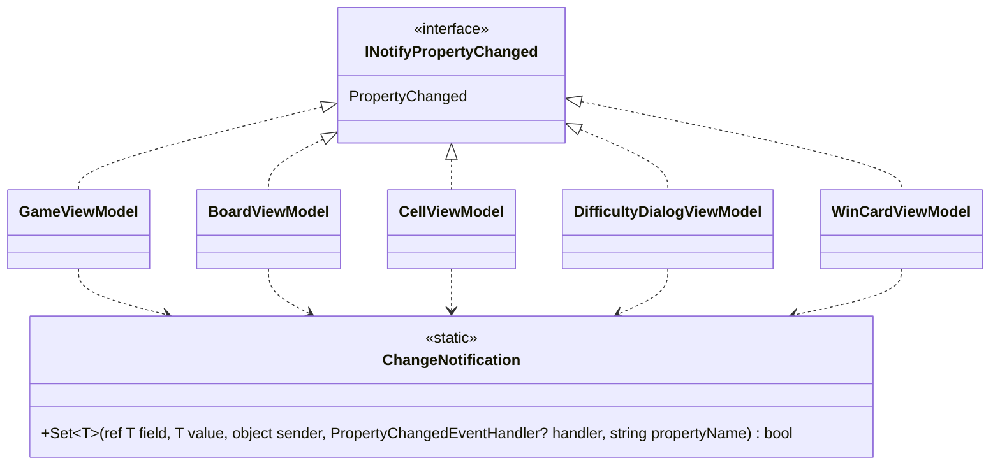

# 課題 T2: ビューモデルの変化の通知の設計

## 1. 何を決めるか（What）

5 つのビューモデルが `INotifyPropertyChanged` を実装するときの、次の 2 点を決める。

- 「値が変わったときだけフィールドを書き換えて `PropertyChanged` を起こす」という定型を、どこに置くか
- 他のプロパティから計算されるプロパティ（例: 状態から決まる読み上げの名前）の通知を、どう書くか

作らないもの: 共通の基底クラス、インターフェイス、コード生成・IL の書き換え（Fody など）、`PropertyChangedEventArgs` のキャッシュ、スレッドをまたぐ通知の仕組み。

## 2. 型の構成



- 5 つのビューモデルは、それぞれが直接 `INotifyPropertyChanged` を実装する（`sealed` のクラス。継承の階層は作らない）。`event PropertyChangedEventHandler? PropertyChanged;` の 1 行は各クラスに書く。
- 「比べて、変わったら書き換えて通知する」の数行だけを、静的な補助のクラス `ChangeNotification` の `Set` に置く（合成）。置き場所はデスクトップ版のプロジェクトの `ViewModels` の名前空間で、`internal` にする。
- 計算されるプロパティは getter で計算し、元になるプロパティの `Set` が `true`（変わった）を返したときに、そのプロパティの名前で `PropertyChanged` を起こす。

### 補助のクラス

```csharp
using System.ComponentModel;
using System.Runtime.CompilerServices;

namespace Shos.Minesweeper.Desktop.ViewModels;

// ビューモデルの変化の通知の定型。基底クラスにせず、各ビューモデルから呼ぶ。
internal static class ChangeNotification
{
    // 値が変わったときだけ field を書き換えて通知し、変わったかどうかを返す。
    public static bool Set<T>(ref T field, T value, object sender, PropertyChangedEventHandler? handler,
                              [CallerMemberName] string propertyName = "")
    {
        if (EqualityComparer<T>.Default.Equals(field, value))
            return false;
        field = value;
        handler?.Invoke(sender, new PropertyChangedEventArgs(propertyName));
        return true;
    }
}
```

- イベントは宣言したクラスの中でしか起こせないので、`handler` に呼び出し時点の `PropertyChanged` を渡してもらう。`Set` はその場で呼ぶので、その時点の購読者に届く。
- `[CallerMemberName]` により、setter の中から呼べばプロパティの名前を書かずに済む（名前の書き間違いが起きない）。

## 3. 1 つのビューモデルの例（CellViewModel）

`Face`（マスの見た目: 未開放・旗・数字など）と `IsPressed`（押下中）の 2 つのプロパティと、`Face` から計算される `AccessibleName` を持つ例である。`CellFace` と `CellNames` は、表示の部品の側にある型を仮定している（「6. 仮定」）。

```csharp
using System.ComponentModel;

namespace Shos.Minesweeper.Desktop.ViewModels;

public sealed class CellViewModel(int row, int column) : INotifyPropertyChanged
{
    public event PropertyChangedEventHandler? PropertyChanged;

    public int Row { get; } = row;
    public int Column { get; } = column;

    CellFace face = CellFace.Covered;
    public CellFace Face
    {
        get => face;
        set
        {
            if (ChangeNotification.Set(ref face, value, this, PropertyChanged))
                PropertyChanged?.Invoke(this, new PropertyChangedEventArgs(nameof(AccessibleName)));
        }
    }

    bool isPressed;
    public bool IsPressed
    {
        get => isPressed;
        set => ChangeNotification.Set(ref isPressed, value, this, PropertyChanged);
    }

    // 読み上げの名前は Face から決まる。Face が変わったときに一緒に通知する。
    public string AccessibleName => CellNames.Of(Row, Column, Face);
}
```

テストは、Avalonia を起動せずに xUnit で購読して確かめる（例）。

```csharp
[Fact]
public void ChangingFaceNotifiesFaceAndAccessibleName()
{
    var cell = new CellViewModel(0, 0);
    var changed = new List<string?>();
    cell.PropertyChanged += (_, e) => changed.Add(e.PropertyName);

    cell.Face = CellFace.Flagged;

    Assert.Equal([nameof(CellViewModel.Face), nameof(CellViewModel.AccessibleName)], changed);
}

[Fact]
public void SettingTheSameFaceDoesNotNotify()
{
    var cell = new CellViewModel(0, 0);
    var changed = new List<string?>();
    cell.PropertyChanged += (_, e) => changed.Add(e.PropertyName);

    cell.Face = CellFace.Covered;

    Assert.Empty(changed);
}
```

## 4. そう決めた理由（Why）

1. **基底クラス（`ObservableObject` のようなもの）を作らない。** 共通にしたいのは「比べて、書き換えて、通知する」という同じ意図の数行の定型だけで、ビューモデルどうしに is-a の関係も、差し替えて使う多態もない。共通処理の再利用だけが目的の継承に当たる（スキルの判断ルール 9、object-design.md の「再利用のための継承は合成に変える」）。基底クラスにすると、各ビューモデルを読むのに基底を見に行く必要があり、ビューモデルが別の基底を持ちたくなったときに身動きが取れなくなる。
2. **定型は静的な補助のメソッドで共有する（合成）。** 5 つのクラスに `SetField` を写すと、「同じ値なら通知しない」という同じ意図が 5 か所に重なる（Once And Only Once）。判断ルール 9 は、重複を消したいなら静的な補助のメソッドなどの合成で行うとしているので、比べ方と通知の手順は `ChangeNotification.Set` の 1 か所に置く。これで比べ方を変えるとき（例: 浮動小数の比較）も直す先が 1 つで済む。各クラスに残るのは `event` の宣言の 1 行と、各プロパティの `Set` の呼び出しで、どちらもクラスを読めば全体が分かる。
3. **`Set` は変わったかどうかを `bool` で返す。** 計算されるプロパティの通知（`Face` → `AccessibleName`）や、変わったときだけの後処理を、元のプロパティの setter の中に `if` で書ける。「どの変化がどの通知を起こすか」がその setter を見れば分かり、依存の関係を宣言する属性などの仕組みを足さずに済む。
4. **MVVM の支援ライブラリも、コード生成も使わない。** ライブラリを使わないことは決まっている。自前のソースジェネレーターや Fody は、ビューモデル 5 つ・プロパティ十数個に対して、読む・保守する対象（生成の仕組み）を増やすだけで、偶発的複雑さになる。
5. **テストしやすい。** 通知は普通のイベントなので、ビューモデルのテストで購読して、名前と回数を確かめられる。`ChangeNotification` は純粋に近い（引数だけで決まる）ので、単独でもテストできる。

### 捨てた案とトレードオフ

| 案 | 捨てた理由 |
|---|---|
| 共通の基底クラス `ObservableObject` | 再利用だけが目的の継承（判断ルール 9）。全体像が基底と派生に分かれる |
| 各クラスに private の `SetField` を写す | 動くが、同じ意図が 5 か所に重なる。基底クラスよりはましなので、`ChangeNotification` を置くのをやめるなら次点はこれ |
| 通知の名前を文字列で書く（`"Face"`） | 名前を変えたときに嘘になる。`[CallerMemberName]` と `nameof` を使う |
| `PropertyChangedEventArgs` をプロパティごとにキャッシュする | 上級でもマスは 480 個で、1 回の操作で変わるマスの数に対して割り当ては問題にならない。計測で問題が出るまで入れない（判断ルール 5） |
| UI のスレッドへ通知を移す仕組み | タイマーは `DispatcherTimer` を使い、ビューモデルは UI のスレッドでだけ変える前提にするので要らない |

## 5. 作らなかったもの

- 基底クラス・インターフェイス（`IViewModel` など）: 実装を差し替える利用者がいない（YAGNI）
- 依存するプロパティを宣言する仕組み（属性や表）: 計算されるプロパティは数えるほどで、setter の `if` で足りる
- 一括で通知を止める・まとめる仕組み（`BeginUpdate` など）: 盤面を作り直すときは `BoardViewModel` がマスのコレクションを作り直せば足り、要求にない
- イベント引数のキャッシュ、スレッドの切り替え（上の表のとおり）

## 6. 仮定

- ビューモデルのプロパティは、UI のスレッドでだけ変える（経過時間の更新は `DispatcherTimer` で行う）。
- `CellFace`（マスの見た目の種類）と `CellNames.Of`（読み上げの名前）は、UI の技術に依存しない表示の部品（共有のプロジェクト）にあるものとした。名前は例示である。
- 盤面のマスの並びは `BoardViewModel` が `IReadOnlyList<CellViewModel>` などで持ち、難易度を変えたときは一覧ごと作り直して、その一覧のプロパティの変化を通知する。マスの増減を一つずつ知らせる `ObservableCollection` は、必要が見えるまで使わない。
- `ChangeNotification` はデスクトップ版だけが使うので、共有のプロジェクトではなくデスクトップ版のプロジェクトに置く（コンソール版・Web 版には使う側がない）。

## 7. ユーザーの判断が要る点

- `WinCardViewModel` は、勝利の時点の値（時間、ベストタイムかどうか）を受け取って作り、その後に値が変わらないなら、変化の通知は要らない（不変のクラスで足りる）。課題の前提どおり `INotifyPropertyChanged` を実装する形にしたが、値が変わらないと確定するなら、実装を外して読む対象を減らすことを勧める。
- `DifficultyDialogViewModel` の入力欄のように、値が変わったときに検証のメッセージも変わるプロパティは、上の `Face` → `AccessibleName` と同じ形で書く想定である。検証の結果を `INotifyDataErrorInfo` で出すかどうかは、この設計の範囲外として決めていない。
