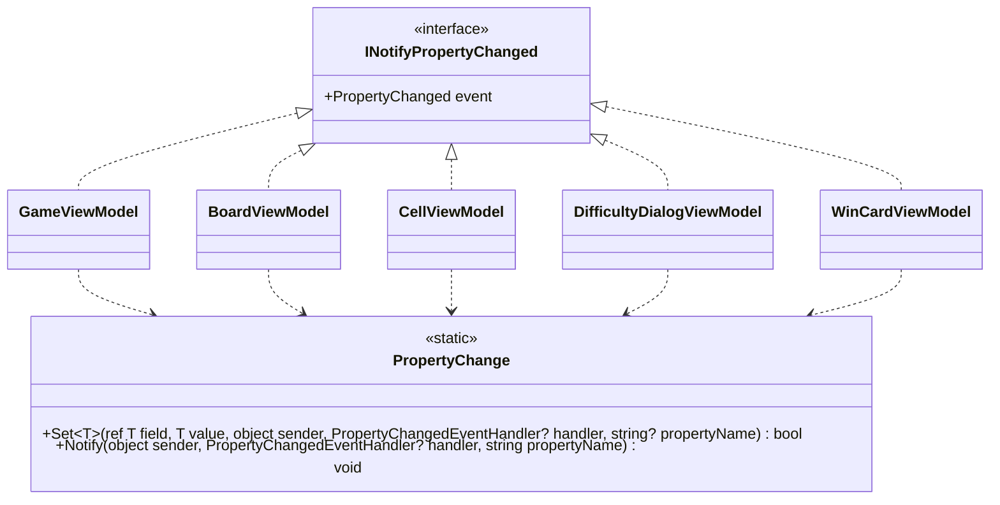

# T2: ビューモデルの変化の通知の設計

適用したスキル: sustainable-code-jp（作業の種類は「設計の相談」）。読んだもの: SKILL.md の全文、object-design.md（必ず読む）、simplicity.md（ジェネリクスの補助メソッドを足すかどうかを決めるため。「YAGNI」「引き算の設計」の節）。

## 1. 何を決めるか（What の言い直し）

5 つのビューモデルが `INotifyPropertyChanged` を実装するときの「値を変えて、変わったときだけ View に知らせる」という数行の定型を、どこに、どういう形で置くかを決める。MVVM の支援ライブラリは使わない（課題の前提）。

作らないもの: ビューモデルの基底クラス、`ICommand` の仕組み、検証（`INotifyDataErrorInfo`）、スレッドの切り替え。どれも課題が求める「変化の通知」の外にある。

## 2. 結論

- **基底クラス（`ViewModelBase` など）は作らない。** 5 つのビューモデルは、それぞれが `INotifyPropertyChanged` を直接実装する。
- 定型の「比べて、代入して、通知する」は、**静的な補助のクラス `PropertyChange` の 1 か所**に置き、各ビューモデルはそれを呼ぶ（継承ではなく合成）。
- ほかのプロパティから計算するプロパティ（算出プロパティ）は、元の値を変えた箇所で**名前を明示して**通知する（`nameof` を使う）。

## 3. 型の構成



| 型 | ひとことで言うと | 置き場所 |
|---|---|---|
| `PropertyChange`（static） | プロパティの値を変え、変わったときだけ通知する | デスクトップ版のプロジェクトの `ViewModels` フォルダー（`internal`） |
| 5 つのビューモデル | それぞれの画面の部分の状態を View に見せる | 同上。各自が `INotifyPropertyChanged` を実装する |

### 補助のクラス

```csharp
using System.ComponentModel;
using System.Runtime.CompilerServices;

namespace Shos.Minesweeper.Desktop.ViewModels;

/// <summary>ビューモデルのプロパティを変え、変わったときだけ View に知らせる。</summary>
internal static class PropertyChange
{
    /// <returns>値が変わったとき true。</returns>
    public static bool Set<T>(ref T field, T value, object sender, PropertyChangedEventHandler? handler,
                              [CallerMemberName] string? propertyName = null)
    {
        if (EqualityComparer<T>.Default.Equals(field, value))
            return false;
        field = value;
        Notify(sender, handler, propertyName!);
        return true;
    }

    public static void Notify(object sender, PropertyChangedEventHandler? handler, string propertyName)
        => handler?.Invoke(sender, new PropertyChangedEventArgs(propertyName));
}
```

- 引数は 5 つあるが、呼ぶ側が書くのは 4 つ（`propertyName` は `CallerMemberName` で埋まる）。`sender` と `handler` を渡すのは、イベントの呼び出しはそのイベントを宣言したクラスの中でしかできない（C# の制約）ためで、イベントを宣言したクラスがデリゲートを渡す形が、基底クラスなしで定型を 1 か所に置く最小の形である。
- 目安（引数 3 つ）を超えるが、`ref` の場所・新しい値・通知の宛先の 3 つは分けられない情報で、1 つの型にまとめると呼ぶ側がかえって長くなるため、この形にとどめる。

### 1 つのビューモデルの例（`CellViewModel`）

マスの見た目（`Appearance`）と、それから決まる読み上げの名前（`AccessibleName`）の 2 つのプロパティの例。

```csharp
using System.ComponentModel;

namespace Shos.Minesweeper.Desktop.ViewModels;

/// <summary>1 つのマスの表示の状態を View に見せる。</summary>
public sealed class CellViewModel : INotifyPropertyChanged
{
    CellAppearance appearance = CellAppearance.Unopened;

    public event PropertyChangedEventHandler? PropertyChanged;

    public CellViewModel(int column, int row) => (Column, Row) = (column, row);

    public int Column { get; }
    public int Row { get; }

    public CellAppearance Appearance
    {
        get => appearance;
        set
        {
            if (PropertyChange.Set(ref appearance, value, this, PropertyChanged))
                PropertyChange.Notify(this, PropertyChanged, nameof(AccessibleName));
        }
    }

    // Appearance から決まる。Appearance を変えたときに一緒に知らせる
    public string AccessibleName => CellNames.Describe(Column, Row, appearance);
}
```

- `CellAppearance` と `CellNames.Describe` は、表示の状態と読み上げの名前を表す既存の型を仮定している（例のために置いた名前で、本題ではない）。
- `Column`、`Row` は変わらないので、`get` だけにして通知しない。
- ほかの 4 つのビューモデルも同じ形で書く。例: `GameViewModel` の `ElapsedSeconds`、`RemainingMines`、`WinCardViewModel` の `IsVisible` など。

## 4. そう決めた理由（Why）とトレードオフ

### 4.1 基底クラスを作らない

- 5 つのビューモデルに共通なのは、通知の数行の定型だけである。それを共有するためだけの基底クラスは「再利用のための継承」に当たる（スキルの判断ルール 9、object-design.md の「再利用のための継承は合成に変える」）。5 つは同じ種類として差し替えて使うものではなく（多態の is-a がない）、階層を作る理由がない。
- 基底クラスがないと、各ビューモデルの全体像がそのクラスの中だけで読める（`PropertyChanged` がどこで宣言され、いつ呼ばれるかが、基底を開かずに分かる）。
- 捨てた案 A（`ViewModelBase` に `SetProperty` を置いて継承する）: 呼ぶ側は `SetProperty(ref x, value)` と 2 引数で短く書けるのが利点。しかし、ビューモデルが基底に結び付き、あとで基底に「ついでの」機能（コマンドの補助、ログなど）が足されやすく、壊れやすい基底クラスの問題を招く。呼ぶ側の数語の短さより、この結合を避ける方を取った。

### 4.2 定型は静的な補助のクラスの 1 か所に置く

- 「値が同じなら何もしない、違えば代入して通知する」は、5 つのビューモデルで**同じ意図**である（たまたま似ているのではない）。判断ルール 9 は、共有したいなら静的な補助のメソッドのような合成で行うとしている。比較の仕方を変える（例: 通知の前後に何かを足す）ときに、直す場所が 1 か所で済む。
- 捨てた案 B（各ビューモデルに private の `Set` を 1 つずつ書く）: 依存がまったくなく読みやすいが、同じ意図の 5〜6 行が 5 か所に並ぶ。比較の条件を 1 か所で直せなくなるので、補助のクラスにした。重複を許しても判断ルール 9 には反しないので、チームが「ビューモデルは自分のファイルだけで完結させたい」と判断するなら、案 B に切り替えてもよい（ユーザーの判断が要る点）。
- `Set` を `T` のジェネリクスにするのは、bool・int・列挙・文字列のどれにも同じ比較を使うためで、今日の 5 つのビューモデルに型の違うプロパティが実際にある（将来への備えではない）。

### 4.3 算出プロパティは名前を明示して通知する

- `AccessibleName` のように別のプロパティから決まる値は、元の値（`Appearance`）が変わった箇所で `nameof` を使って通知する。どの変化がどの通知を起こすかが、setter を読めば分かる。
- 捨てた案 C（依存関係を属性や表で宣言し、自動で通知する）: 仕組みを読まないと、いつ通知されるかが分からなくなる。依存の組は各ビューモデルに数個しかないので、偶発的複雑さになる。
- 捨てた案 D（`string.Empty` で「全部変わった」と通知する）: 手軽だが、何が変わったかを表さず、マスが多い上級（480 マス）やカスタムで無駄な再描画を招く。新しいゲームを始めて多くの値が一度に変わるときも、変わるプロパティを名前で通知する。

### 4.4 テストのしやすさ

- 通知は、ビューモデルを作って `PropertyChanged` を購読するだけで、Avalonia を起動せずに xUnit で確かめられる（「同じ値なら通知しない」「`Appearance` を変えると `Appearance` と `AccessibleName` が通知される」）。
- `PropertyChange` も静的な純粋に近いメソッドなので、単独でテストできる。差し替え口は要らない。

## 5. 置いた仮定

- ビューモデルのプロパティは UI スレッド（Avalonia の `Dispatcher.UIThread`）でだけ変える。経過時間は `DispatcherTimer` で進める。そのため、通知の中でスレッドを切り替える処理は入れない（問題文にない状況への備えは足さない）。
- `.NET 10`、C# の `Nullable` が有効。C# 14 の `field` キーワードは使える環境だが、`ref` で補助のメソッドに渡せないので使わず、明示的なフィールドにした。
- デスクトップ版のビューモデルは、デスクトップ版のプロジェクトの中にだけ置く。コンソール版などと共有する予定の部品ではないので、補助のクラスは `internal` にした。
- `PropertyChangedEventArgs` をプロパティごとにキャッシュする最適化は入れない（計測していないため。判断ルール 5）。

## 6. ユーザーの判断が要る点

- 4.2 の案 B（各ビューモデルが自分の `Set` を持つ）との選択。本設計は、同じ意図を 1 か所に置く方を推す。
- 補助のクラスの名前 `PropertyChange`（呼ぶ側で `PropertyChange.Set(...)`、`PropertyChange.Notify(...)` と読めるように付けた）。
