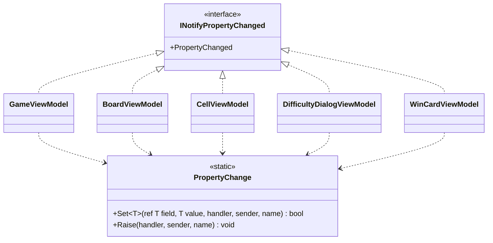

# T2 回答: ビューモデルの変化の通知の書き方

## 1. What（何を決めるか）

5 つのビューモデル（`GameViewModel`、`BoardViewModel`、`CellViewModel`、`DifficultyDialogViewModel`、`WinCardViewModel`）が `INotifyPropertyChanged` を実装する。そのときの書き方を 1 つに揃える。MVVM の支援ライブラリは使わない。

決めること:
- 共通の基底クラスを置くか、置かないか
- 「値が変わったときだけ代入して通知する」という定型を、どこに 1 回だけ書くか
- 別のプロパティから計算するプロパティ（派生プロパティ）を、どう通知するか

## 2. 置いた仮定

- 対象は .NET 10、C# 14 とする。プロパティの `field` キーワードが使えるので、裏の変数を宣言しなくてよい。
- ビューモデルのプロパティは UI スレッドの上でだけ変わる。経過時間は `DispatcherTimer` で進める。なので、通知の部品でスレッドを切り替えることはしない。
- 盤面のマスの集まりは、ゲームを始めるたびに作り直して丸ごと差し替える。1 つのゲームの間に、マスが増えたり減ったりはしない。なので `ObservableCollection` は使わない。`BoardViewModel.Cells` を読み取り専用のリストにし、差し替えたときにプロパティの変化として通知する。
- ビューモデルは Avalonia の型（`AvaloniaObject` など）に依存しない。Avalonia を起動しないで、xUnit でテストできるようにするためである。

## 3. 型の構成



- 5 つのビューモデルはどれも、`INotifyPropertyChanged` を**直接**実装する。共通の基底クラス（`ViewModelBase` など）は置かない。
- 定型は静的クラス `PropertyChange` の 2 つのメソッドに 1 回だけ書く。
  - `Set`: 値が同じなら何もせずに `false` を返す。違えば代入し、通知して、`true` を返す。
  - `Raise`: 派生プロパティのような、代入のない通知に使う。
- イベントの宣言 `public event PropertyChangedEventHandler? PropertyChanged;` は、各ビューモデルに 1 行ずつ残る。C# では、イベントを起こせるのは宣言したクラスの中だけなので、イベントのデリゲートを引数で `PropertyChange` に渡す。

## 4. コード

### 4.1 通知の部品

```csharp
using System.Collections.Generic;
using System.ComponentModel;
using System.Runtime.CompilerServices;

namespace Shos.Minesweeper.Desktop.ViewModels;

/// <summary>ビューモデルのプロパティの変化を View に知らせる。</summary>
static class PropertyChange
{
    /// <summary>値が変わったときだけ代入して知らせる。変わったら true を返す。</summary>
    public static bool Set<T>(ref T field, T value,
                              PropertyChangedEventHandler? handler, object sender,
                              [CallerMemberName] string? propertyName = null)
    {
        if (EqualityComparer<T>.Default.Equals(field, value))
            return false;
        field = value;
        Raise(handler, sender, propertyName);
        return true;
    }

    public static void Raise(PropertyChangedEventHandler? handler, object sender, string? propertyName)
        => handler?.Invoke(sender, new PropertyChangedEventArgs(propertyName));
}
```

引数は 4 つで、3 つの目安を超える。ただし、呼ぶ側が渡すのは 4 つだけで、`propertyName` はコンパイラーが埋める。イベントを起こせるのは宣言したクラスの中だけという C# の制約があり、`handler` と `sender` を 1 つにまとめる型を足すと、読む対象が増えるだけになる。なので、この形にした。

### 4.2 1 つのビューモデルの例（`CellViewModel`）

マスの見た目 `Appearance`（代入できる）と、そこから計算する読み上げの名前 `AccessibleName`（派生）の 2 つのプロパティの例である。

```csharp
using System.ComponentModel;

namespace Shos.Minesweeper.Desktop.ViewModels;

/// <summary>盤面の 1 マスを View に見せる。</summary>
sealed class CellViewModel(int row, int column) : INotifyPropertyChanged
{
    public event PropertyChangedEventHandler? PropertyChanged;

    public int Row { get; } = row;
    public int Column { get; } = column;

    public CellAppearance Appearance
    {
        get;
        set
        {
            if (PropertyChange.Set(ref field, value, PropertyChanged, this))
                PropertyChange.Raise(PropertyChanged, this, nameof(AccessibleName));  // 見た目から決まるので一緒に知らせる
        }
    }

    public string AccessibleName => CellNames.Of(Row, Column, Appearance);
}
```

派生プロパティがなければ、1 行で書ける。

```csharp
public int RemainingMines
{
    get;
    private set => PropertyChange.Set(ref field, value, PropertyChanged, this);
}
```

### 4.3 テストの例（xUnit）

Avalonia を起動しないで、通知を確かめられる。

```csharp
[Fact]
public void ChangingAppearanceNotifiesAppearanceAndAccessibleName()
{
    var cell = new CellViewModel(0, 0);
    var names = new List<string?>();
    cell.PropertyChanged += (_, e) => names.Add(e.PropertyName);

    cell.Appearance = CellAppearance.Flagged;

    Assert.Equal([nameof(CellViewModel.Appearance), nameof(CellViewModel.AccessibleName)], names);
}

[Fact]
public void SettingTheSameAppearanceDoesNotNotify()
{
    var cell = new CellViewModel(0, 0) { Appearance = CellAppearance.Flagged };
    var notified = false;
    cell.PropertyChanged += (_, _) => notified = true;

    cell.Appearance = CellAppearance.Flagged;

    Assert.False(notified);
}
```

## 5. Why（なぜそう決めたか）

### 5.1 基底クラスを置かない
- `ViewModelBase` を置いて 5 つが継承する形が最もよくある。ただし、それは「同じ数行の定型を共有するため」だけの継承である。5 つのビューモデルは、互いに入れ替えて使う「〜の一種」ではない。共通の処理を再利用するためだけの継承になり、合成を優先する原則（スキルの判断ルール 9）に当たるので、採らない。
- 基底クラスがあると、各ビューモデルを読むたびに基底クラスも見なければならない。基底クラスは「便利なもの」が足されて育ちやすく、そうなると 5 つすべてに影響する（壊れやすい基底クラス）。直接実装なら、クラスの全体がそのファイルだけで分かる。
- 継承の枠を空けておけるので、あとで本当に多態が必要になったとき（例: 難易度ダイアログと勝利カードを同じ「ダイアログ」として扱う）に使える。

### 5.2 定型は静的な補助のメソッドに 1 回だけ書く（合成）
- 「同じ値なら通知しない」「代入してから通知する」という判断は、5 つのビューモデルで同じ意図である（たまたま似ているのではない）。なので、1 か所に集める（Once And Only Once）。重複の共有は継承でなく、静的な補助で行う（判断ルール 9）。
- 各ビューモデルに残る重複は、イベントの宣言の 1 行だけである。これは C# の言語の制約から来るもので、隠すと意図が見えにくくなる。
- `Set` が `bool` を返すので、派生プロパティの通知や「値が変わったときだけする処理」を、呼ぶ側に素直に書ける。何を一緒に知らせるかは、そのプロパティを持つビューモデルが知っている（Expert）。

### 5.3 `field` キーワードと `CallerMemberName`
- 裏の変数の宣言と、プロパティ名の文字列を書かずに済む。書き間違える場所がなくなり、プロパティの記述が「値を置き、変わったら知らせる」という意図だけになる（S/N 比）。
- 派生プロパティの名前は `nameof` で書き、名前を変えたときにコンパイラーが追えるようにする。

### 5.4 捨てた案

| 案 | 捨てた理由 |
|---|---|
| 共通の基底クラス `ViewModelBase` | 定型の共有だけが目的の継承（判断ルール 9）。全体像が基底と派生に分かれる |
| 各ビューモデルに `SetField` をそれぞれ書く | 同じ意図の判断（等しいかの比べ方）が 5 か所に重なる。直すときに 5 か所を直すことになる |
| 自作のソース ジェネレーター、IL の書き換え | 支援ライブラリを使わないと決めたことの精神に反し、数行の定型のために、ビルドの仕組みという読む対象を増やす |
| ビューモデルを `AvaloniaObject` にして `StyledProperty` を使う | ビューモデルが Avalonia に依存し、Avalonia を起動しないテストができなくなる |
| マスの集まりを `ObservableCollection` にする | ゲームの間にマスは増減しない（仮定）。丸ごと差し替えをプロパティの通知で伝えれば足りる |

## 6. 作らなかったもの

- **`PropertyChangedEventArgs` のキャッシュ**: 通知のたびに引数のオブジェクトを作る。マスの数は上級でも 480 で、1 回の操作で変わるのは開いたマスだけなので、計測なしに最適化はしない。遅いと計測で分かったら、`PropertyChange` の中だけで直せる。
- **UI スレッドへの切り替え**: プロパティは UI スレッドでだけ変わるという仮定のもとで入れていない。別のスレッドから変える必要が出たら、通知ではなく、変える側で `Dispatcher.UIThread` に移す。
- **`INotifyPropertyChanging`、一括の通知（`string.Empty` で全部を知らせる）、コマンドの基底**: 要求にないので入れていない。コマンド（`ICommand`）の書き方は、この課題の範囲の外とした。
- **`PropertyChange` のインターフェイス化**: 差し替える理由がない（実装は 1 つ、I/O もない）。

## 7. ユーザーの判断が要る点

- C# 14 の `field` キーワードを使う前提にした。対象の言語の版が古いときは、裏の変数（`int remainingMines;`）を宣言して `ref remainingMines` を渡す形に変える（ほかは同じ）。
- 派生プロパティの通知は、元のプロパティの setter に手で書く。派生プロパティが増えて、通知を忘れることが目立ってきたら、そのときにビューモデルの中で「見た目が変わったら知らせるもの」を 1 つのメソッドにまとめることを考える。
