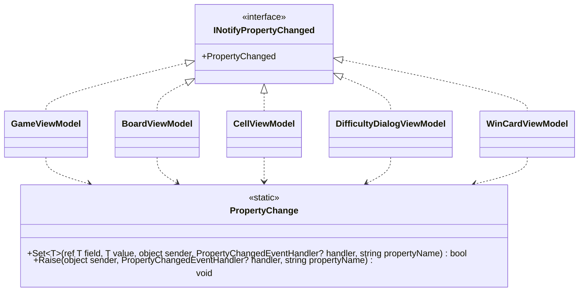

# T2: ビューモデルの変化の通知の設計

## 1. 何を決めるか（What の言い直し）

5 つのビューモデル（`GameViewModel`、`BoardViewModel`、`CellViewModel`、`DifficultyDialogViewModel`、`WinCardViewModel`）は、どれも `INotifyPropertyChanged` を実装する。決めるのは次の 2 点である。

- 「値が変わったときだけ、フィールドを書き換えて `PropertyChanged` を上げる」という数行の定型を、5 つのクラスでどう書くか
- ほかの値から決まるプロパティ（例: 状態から決まる表示）の通知をどう上げるか

作らないもの: MVVM の支援ライブラリ（使わないと決まっている）、ビューモデルの共通の基底クラス、通知の仕組みの差し替え口（インターフェイス）、コマンドの仕組み（この課題の範囲外）。

## 2. 型の構成



- 5 つのビューモデルは、それぞれが直接 `INotifyPropertyChanged` を実装し、`PropertyChanged` のイベントを自分で宣言する。共通の基底クラス（`ViewModelBase` など）は作らない。
- 「比べて、書き換えて、通知する」の手順は、静的なクラス `PropertyChange` の 1 か所に置く（内部の型。`internal static`）。ビューモデルは、これを呼ぶだけにする。
- 派生するプロパティ（計算で決まるプロパティ）は、元のプロパティの `Set` が `true`（変わった）を返したときに、`PropertyChange.Raise` で `nameof` を指定して通知する。

## 3. コード

### 3.1 通知の補助

```csharp
using System.Collections.Generic;
using System.ComponentModel;
using System.Runtime.CompilerServices;

namespace Shos.Minesweeper.Desktop.ViewModels;

/// <summary>ビューモデルのプロパティの変化を View に知らせる手順。</summary>
internal static class PropertyChange
{
    /// <summary>値が変わったときだけ field を書き換えて通知し、変わったかどうかを返す。</summary>
    public static bool Set<T>(ref T field, T value, object sender, PropertyChangedEventHandler? handler,
                              [CallerMemberName] string propertyName = "")
    {
        if (EqualityComparer<T>.Default.Equals(field, value))
            return false;
        field = value;
        Raise(sender, handler, propertyName);
        return true;
    }

    /// <summary>ほかの値から決まるプロパティの変化を知らせる。</summary>
    public static void Raise(object sender, PropertyChangedEventHandler? handler, string propertyName)
        => handler?.Invoke(sender, new PropertyChangedEventArgs(propertyName));
}
```

### 3.2 ビューモデルの例（`GameViewModel` の 2 つのプロパティ）

```csharp
using System.ComponentModel;

namespace Shos.Minesweeper.Desktop.ViewModels;

public sealed class GameViewModel : INotifyPropertyChanged
{
    public event PropertyChangedEventHandler? PropertyChanged;

    int remainingMineCount;
    /// <summary>残り地雷数（地雷の数 - 旗の数。負にもなる）。</summary>
    public int RemainingMineCount
    {
        get => remainingMineCount;
        private set => PropertyChange.Set(ref remainingMineCount, value, this, PropertyChanged);
    }

    GameStatus status;
    /// <summary>ゲームの状態（準備中・進行中・勝利・敗北）。</summary>
    public GameStatus Status
    {
        get => status;
        private set
        {
            if (PropertyChange.Set(ref status, value, this, PropertyChanged))
                PropertyChange.Raise(this, PropertyChanged, nameof(IsWinCardVisible));
        }
    }

    /// <summary>勝利カードを出すか。状態から決まる。</summary>
    public bool IsWinCardVisible => Status == GameStatus.Won;

    // 盤面を開く・旗を立てるなどの操作が、ゲームのロジックの結果から
    // RemainingMineCount と Status を書き換える（この課題の範囲外なので省略）。
}
```

ほかの 4 つも同じ形にする。1 つのビューモデルに要るのは、イベントの宣言 1 行と、プロパティごとの `PropertyChange.Set` の呼び出しだけである。

### 3.3 テストでの確かめ方（例）

通知は、Avalonia を起動せずに xUnit で確かめられる。

```csharp
[Fact]
public void 勝ったときに状態と勝利カードの表示の変化を知らせる()
{
    var game = /* 1 手で勝てる盤面の GameViewModel */;
    var changed = new List<string?>();
    game.PropertyChanged += (_, e) => changed.Add(e.PropertyName);

    game.Open(/* 最後の安全なマス */);

    Assert.Contains(nameof(GameViewModel.Status), changed);
    Assert.Contains(nameof(GameViewModel.IsWinCardVisible), changed);
}
```

## 4. そう決めた理由（Why）

1. **基底クラスを作らない。** 5 つのビューモデルは、「ビューモデルの一種」として多態で差し替える関係にない。基底クラスを作る動機は「数行の定型を共有したい」だけで、これは再利用のための継承に当たる（判断ルール 9、合成優先の原則）。基底に置くと、各ビューモデルの全体像を読むのに基底も見る必要が生じ、基底に何かを足したくなったとき（例: 別の共通処理）に 5 つすべてが巻き込まれる。
2. **共有は静的な補助メソッドで行う（合成）。** 「値が変わったときだけ書き換えて通知する」は 5 つで同じ意図なので、1 か所に集める（Once And Only Once）。等しさの判定を忘れて余計な通知を出す、名前の文字列を打ち間違える、といった誤りは、この 1 か所と `[CallerMemberName]` で防げる。継承の階層を作らずに済み、各ビューモデルは `INotifyPropertyChanged` を直接実装するので、クラスだけを読めば全体が分かる。
3. **イベントは各ビューモデルが持つ。** `PropertyChange` は状態を持たない。イベントの持ち主は通知する本人であり（責務は状態の持ち主に置く）、補助はイベントの呼び出し元の値（`PropertyChanged`）と送り手（`this`）を引数で受け取るだけにした。補助のインスタンスを各ビューモデルに持たせる形（イベントの add/remove を転送する形）も考えたが、転送の定型が増えるだけで得るものがないので捨てた。
4. **派生するプロパティは明示的に通知する。** `IsWinCardVisible` のように計算で決まるプロパティは、元の値が変わったところで `nameof` で通知する。依存関係を属性や表で宣言して自動で通知する仕組みは、今の規模（派生するプロパティが各ビューモデルに数個）では読む対象を増やすだけなので入れない。`Set` が `bool` を返すのは、この「変わったときだけ続けて通知する」を書くためである。
5. **Avalonia の `AvaloniaObject` や `StyledProperty` はビューモデルに使わない。** それらはコントロールのための仕組みで、使うとビューモデルが Avalonia に依存し、UI を起動せずにテストしにくくなる。`INotifyPropertyChanged` は .NET の標準で、Avalonia のバインディングがそのまま扱える。

### 数値の目安を超えたところ

`PropertyChange.Set` の引数は 5 つで、目安の 3 つを超える。`ref` のフィールド・新しい値・送り手・イベント・名前（呼び出し側は書かない）はどれも 1 回の通知に欠かせず、まとめる型を作ると呼び出しのたびに組み立ての手間とノイズが増えるので、この形のままにした。呼び出し側で書くのは 4 つで、どの行も同じ並びである。

## 5. 置いた仮定

- 通知は UI のスレッドで上げる。経過時間は Avalonia の `DispatcherTimer` で進め、別のスレッドからビューモデルを書き換えない（別のスレッドから書き換える必要が出たら、そのときに `Dispatcher.UIThread` への切り替えを呼ぶ側に足す）。
- 盤面のマスの集まり（`BoardViewModel` の `Cells`）は、1 回のゲームの間は増減しない。新しいゲームや難易度の変更では、一覧を作り直して `Cells` の変化を通知する。そのため `ObservableCollection` は使わず、`IReadOnlyList<CellViewModel>` とする。マスの中の変化（開いた、旗）は各 `CellViewModel` が自分で通知する。
- `PropertyChangedEventArgs` を毎回作るコストは、上級の盤面（数百のマス）でも問題にならないと見る。計測して問題が見えるまで、引数のキャッシュはしない。
- プロパティの setter は、原則として `private` にする（ビューモデルの外から直接書き換えさせず、操作のメソッドを通す）。`DifficultyDialogViewModel` のカスタムの入力欄のように、View から双方向のバインディングで書き換えるものだけを `public` にする。

## 6. 判断が要る点

- 5 つのビューモデルがそれぞれ `private` の 1 行のラッパー（`bool Set<T>(ref T f, T v, [CallerMemberName] string n = "") => PropertyChange.Set(ref f, v, this, PropertyChanged, n);`）を持てば、各プロパティの setter は短くなる。その代わり同じ 1 行が 5 か所に並ぶ。ここでは通り道を 1 つにするために入れていない。プロパティの数が多くて setter の長さが読みにくさになるなら、入れてよい。
